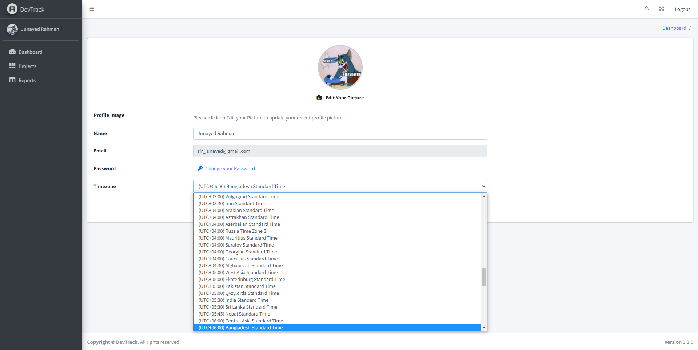

# DevTrack

• A web application designed to monitor user
activities, including tracked time, mouse clicks, screenshots, web camera images, and run-
ning applications on the desktop.
• Implemented a robust back-end utilizing a Web API (REST) architecture to facilitate seam-
less communication between the desktop application and the web application, enabling
data retrieval and synchronization.
• Designed a comprehensive tracking system that captures diverse user interactions, includ-
ing time tracking, mouse clicks, screenshots, and even web camera images, providing deep
insights into user behaviors.
• Implemented a project management feature allowing users to create new projects and
invite team members via email. Managed the invitation process through a Worker Service,
enhancing collaboration and project organization.
• Implemented advanced data visualization techniques, enabling users to analyze and in-
terpret tracked activity data through intuitive graphs, charts, and visual representations

## Web API
|  |  |  |  |
|---------|---------|---------|---------|
|  |  |  |  |

## Web Application
### Login and Sign Up
|  |  |
|---------|---------|
|  | |

### Dashboard
|  |
|---------|
|  |

### Project Creation, Editing & Details
|  |  |  |  |
|---------|---------|---------|---------|
|  |  |  |  |
|  |  |  |
|  |  |  

### Member Invitation & Response
|  |  |
|---------|---------|
|  | |

### Settings
|  |  |
|---------|---------|
|  | |

## License

This project is licensed under the [Apache License 2.0](LICENSE).
